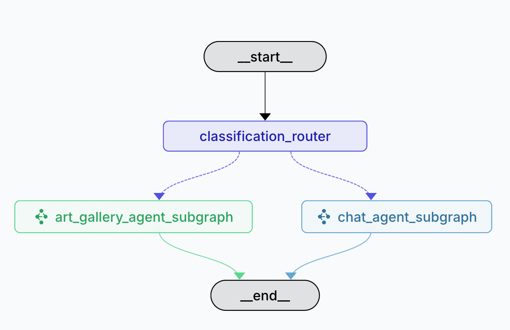

# 艺术画廊多智能体系统 (Art Gallery Multi-Agent System)

一个基于 LangGraph 的多智能体系统，集成小度智能终端 MCP 服务，为用户提供沉浸式艺术品导览和个性化家居装饰建议。通过多个专业智能体的协作，实现从艺术品检索、内容生成到智能设备交互的完整闭环体验。

## 系统概述



## 核心功能

### 🎨 智能艺术品导览
- **沉浸式语音讲解**：将精选艺术品信息推送至小度设备，享受专业级语音导览体验
- **多维度艺术解读**：从历史背景、创作技法到艺术价值的全方位介绍

### 🏠 个性化家居装饰顾问
- **AI驱动的装饰建议**：基于用户喜好和空间特点，智能推荐最适合的装饰画作
- **实时视觉预览**：将推荐画作直接推送到小度智能屏，让您在家中即可预览装饰效果
- **风格匹配算法**：精准匹配家居风格与艺术作品，打造和谐统一的居住美学


## MCP 集成核心实现

### 1. MCP 客户端管理器 (`tools/mcp_client.py`)

```python
class MCPClientManager:
    """MCP 客户端管理器，使用 langchain_mcp_adapters"""
    
    async def get_tools(self) -> List[BaseTool]:
        """获取 MCP 服务器提供的所有工具"""
        if self._tools is None:
            client = await self._get_mcp_client()
            self._tools = await client.get_tools()
        return self._tools
```

### 2. 动态工具加载 (`tools/art_gallery_tools.py`)

```python
async def get_art_gallery_tools_with_mcp() -> List:
    """获取包含MCP工具的艺术画廊工具集合"""
    from art_gallery_system.tools.mcp_client import get_tools
    
    # 获取基础工具
    tools = ART_GALLERY_TOOLS.copy()
    
    # 添加MCP工具
    mcp_tools = await get_tools()
    tools.extend(mcp_tools)
    
    return tools
```

### 3. 图初始化时的异步工具加载 (`graph.py`)

```python
async def initialize_graph_tools():
    """异步初始化图工具"""
    global ART_GALLERY_TOOLS_WITH_MCP
    art_tools = await get_art_gallery_tools_with_mcp()
    ART_GALLERY_TOOLS_WITH_MCP = art_tools

# 在模块加载时异步初始化
asyncio.run(initialize_graph_tools())
```

### 4. MCP 配置文件结构

```json
{
  "mcpServers": {
    "xiaodu_mcp_server": {
      "url": "https://xiaodu.baidu.com/dueros_mcp_server/mcp/",
      "transport": "streamable_http",
      "headers": {
        "Access_Token": "${ACCESS_TOKEN}"
      }
    }
  }
}
```

## 快速开始

### 环境要求
- Python 3.10+
- LangGraph
- LangChain

### 安装依赖
```bash
conda create -n art_gallery_agent python=3.11
conda activate art_gallery_agent
pip install -r requirements.txt
```

### 创建配置文件
```bash
# 进入目录并创建配置文件
cd clients/art_gallery_agent
# 准备配置文件和环境变量
cp servers_config.json.example servers_config.json
cp .env.example .env
```

- JSON 配置（文件 `servers_config.json`）
> 配置加载规则：程序会在同目录或当前工作目录下查找 `servers_config.json`。

- .env 文件配置环境变量
> 配置加载规则：程序会在同目录或当前工作目录下查找 `.env` 文件。

### 基本使用
在langgraph.json的同级目录下执行
```bash
langgraph dev
```
